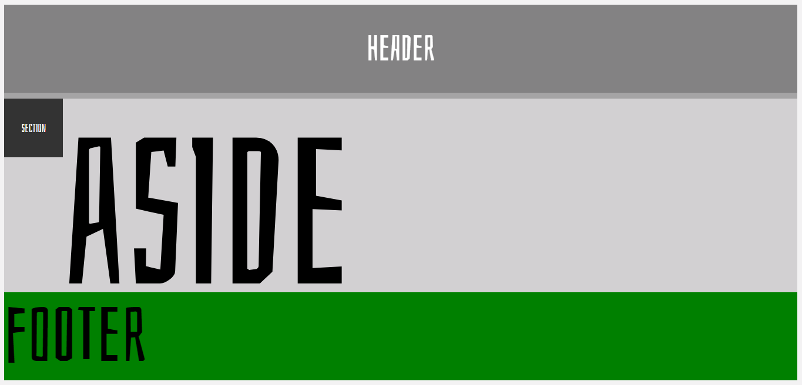

# CSS Transitions Experiment

This repository contains a basic an `index.pug` with a **header**, a **section**, an **aside** and a **footer**. 

The `CSS` contains some _transforms_ and _transitions_ that change the properties values.

Try moving the mouse around the different sections to see what happens!

When you finish downloading the repository, open the console and type `npm install` to install dependencies in the folder. And type `node app.js` to start.

